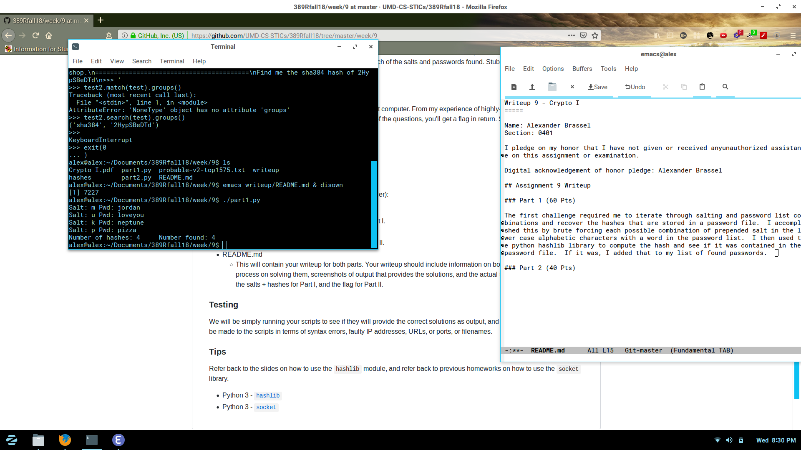

Writeup 9 - Crypto I
=====

Name: Alexander Brassel
Section: 0401

I pledge on my honor that I have not given or received anyunauthorized assistance on this assignment or examination.

Digital acknowledgement of honor pledge: Alexander Brassel

## Assignment 9 Writeup

### Part 1 (60 Pts)

The first challenge required me to iterate through salting and password list combinations and recover the hashes that are stored in a password file.  I accomplished this by brute forcing each possible combination of prepended salt in the lower case alphabetic characters with a word in the password list.  I then used the python hashlib library to compute the hash and see if it was contained in the password file.  If it was, I added that to my list of found passwords.

My findings were: 
Salt: m	Pwd: jordan
Salt: u	Pwd: loveyou
Salt: k	Pwd: neptune
Salt: p	Pwd: pizza

### Part 2 (40 Pts)

For part 2, I was required to play trivia with the remote server until it gave up and gave me the flag.  I first nc'd in and manually played with it a few times to see what sort of format it was looking for.  I observed that it always contained format along the lines of "Find me the (type) hash of (data)".  Therefore, I wrote a regex that searched for this line in each instruction and computed the correct hexdigest for each query and sent it back (with a new line appended).

I used the python hashlib and regular expression library, and dynamically generated the method required to evaluate the passed expression.  Once I detected that that phrase was no longer being sent, I printed the correct response and flag.  

You win! CMSC389R-{H4sh-5l!ngInG-h@sH3r}

